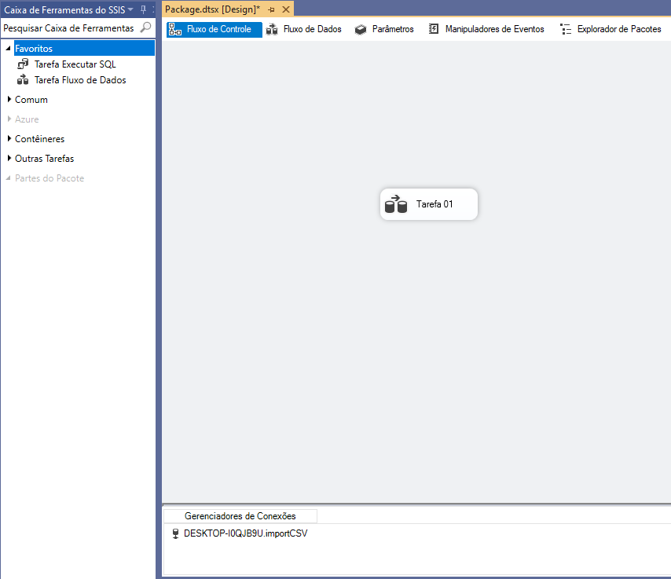

<h1> Projeto de ETL utilizando SSIS <h1>

<h2> A ideia é fazer um simples job de ETL utilizando Microsoft SQL Server Integration Services - SSIS, extrair os dados de uma tabela de um banco de dados do SQL SERVER e salvar em um arquivo .txt </h2>

**Ferramentas utilizadas:**  
SQL SERVER   
VIZUAL STUDIO 2019 

**Etapa 01**

Criar uma conexão com o SQL SERVER 

Conectamos ao Banco de Dados desejado (neste caso usaremos a base de testes importCSV)

**Etapa 02**

Criar uma tarefa de fluxo de dados, chamaremos de Tarefa 01.

Na Tarefa 01 vamos extrair os dados da tabela dbo.Produtos.

Configurar a Origem, chamaremos de Origem OLE DB.

Vamos escolher a tabela dbo.Produtos e visualizar os dados.

Definir o Destino, chamaremos de Saida de Dados

Conectamos a Origem ao Destino.

Configurando Destino:

Definir o nome do arquivo, chamaremos de SaidaArquivo e colocamos o tipo .txt

Marcamos a opção “nomes de coluna na primeira linha de dados”

Deixamos o formato como “delimitado”

Definir o Delimitador como virgula (,) de acordo como está na nossa base.

Em mapeamentos vamos verificar o relacionamento entre as colunas de entrada e destino

**Etapa 03**

Executando o Job e conferir arquivo gerado na paste de destino.

